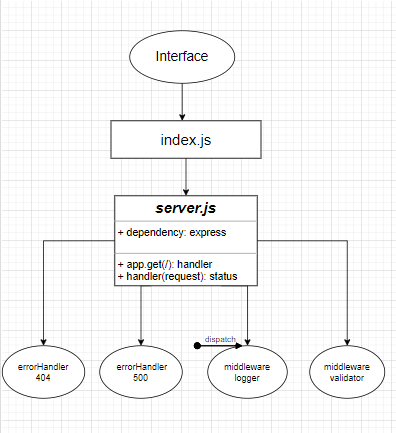

# basic-express-server

#### From a business requirements standpoint, we will be building a basic Express server using best practices, including server modularization, use of middleware, and tests.

* [PullRequest](https://github.com/Sukina12/basic-express-server/pull/1)

* [TestReport](https://github.com/Sukina12/basic-express-server/actions)

* [FrontEnd](https://sukina-express-server.herokuapp.com/)

#### Setup

* .env Requirement : PORT = 9000

#### Running The App :
1. Make new repo.
2. clone the repo.
3. npm i all packages.
4. npm start.
5. Endpoints : return Hello from Sukina message.
6. Tests : 
  * npm run test
  * npm run lint

#### UML diagram :

